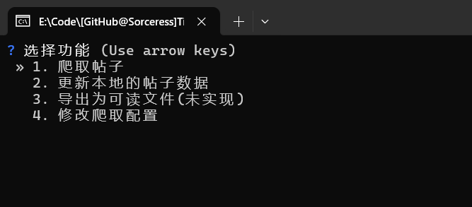
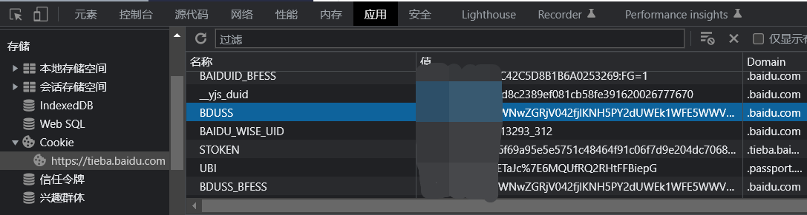
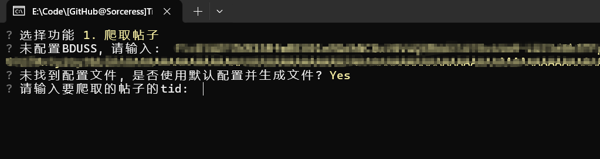
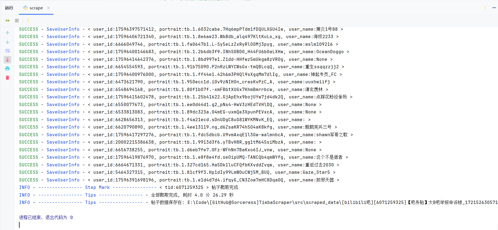

# TiebaScraper

贴吧的数据爬取工具，最大程度的保留原始内容。并且支持对图片、视频、语音等媒体文件的下载。

## TiebaReader

[TiebaReader](https://github.com/Sorceresssis/TiebaReader) 是与此项目对应的贴吧阅读器项目。爬取的数据可以用该工具阅读。点击该项目的 Releases 下载。

## 注意事项

1. 有时第一次运行会出现连接错误，多试几次即可。
2. 已经注销的用户保存的数据会有缺失。

## 普通用户使用教程

可执行程序的使用方法。

### 1. 开始

在 `releases` 里下载最新的可执行文件。解压后双击打开 `TiebaScraper.exe` 就会出现下图的命令行界面。

你可以通过方向键来选择你想要进行的操作



### 2. 获取 BDUSS

贴吧服务端使用 BDUSS 来确认用户身份

BDUSS 是一串由纯 ascii 字符组成的，长度为 192 的字符串

> **Warning**
>
> 使用 BDUSS 可以完成**一切**不需要手机/邮箱验证码的操作，包括 **发帖** / **发私信** /**获取账号上的所有历史发言**
>
> BDUSS 的过期时间长达数年，一般只能通过退出登录或修改密码使其失效
>
> 因此将 BDUSS 泄露给不受信任的人可能导致长期的账号安全风险和隐私泄露风险

在浏览器的 Cookie 和各种表单参数中你都能看到它的身影

搜索 你的浏览器型号+如何查看网站的 Cookie 就能知道如何获取你的贴吧账号的 BDUSS 了

以 Chrome 为例，在任何一个贴吧网页下按 【 F12 】 调出开发者选项，然后你就能在下图的位置找到它



### 3. 初始配置

第一次执行时需要进行一些配置。根据提示输入你的 `BDUSS` 。输入后程序会在同级目录下创建一个 `tieba_auth.json` 文件来保存 `BDUSS` 。爬取配置会先使用默认配置，并在同级目录下创建一个 `scrape_config.json` 文件来保存配置数据。

[爬取配置](./docs/scrape_config.md)



### 4. 获取帖子的 tid

tid 类似于帖子的身份证。你可以从帖子的 url 中获取到它

例如 ：`https://tieba.baidu.com/p/8173224373?share=9105` 这个帖子的 tid 就是 `8173224373` , `?` 后面的文字都无关紧要。

移动端可以通过分享帖子然后复制链接获取 url

### 5. 开始抓取

输入 `tid` 后按下回车键, 等待爬取完成。爬取到的数据保存在工作目录下的 `scraped_data` 文件夹里。

下面测试(下载高清用户头像) `6071259325` : `【吧务贴】大B吧举报申诉楼` , 回复数量: `18377` 条，文件数量: `6,419` , 数据大小: `1.22GB (1,315,974,348 字节)` , 耗时 `4分26.29秒` 。



## Docs

[爬取配置](./docs/scrape_config.md)

[贴吧数据说明](./docs/tieba_data_notes.md)

[贴吧官方错误说明](./docs/tieba_error_desc.md)

[程序说明](./docs/explain.md)

[数据库 DDL](./docs/SQL/DDL.sql)

## 命令行用法（CLI）

> 适用于从源码运行的高级用户或需要批量/脚本化操作的场景。入口脚本位于 `src/cli_entry.py`。

### 环境与依赖

- Python 3.8+（建议 3.9+）
- 依赖安装（如仓库提供 `requirements.txt`）：

```cmd
pip install -r requirements.txt
```

如未使用 `requirements.txt`，至少需要：

```cmd
pip install -U orjson questionary
```

### 快速开始（交互式）

在项目根目录执行：

```cmd
python .\src\cli_entry.py
```

- 首次运行会提示输入 `BDUSS`，并在当前工作目录生成 `tieba_auth.json`。
- 若存在 `tid_list.txt`，程序会询问是否直接按文件批量爬取。
- 如未找到或无法解析 `scrape_config.json`，可按提示生成默认配置。

### 子命令用法

1) 爬取单个帖子（或从文件批量）：

```cmd
:: 指定 tid
python .\src\cli_entry.py scrape 1234567890

:: 从文件批量（默认 tid_list.txt）
python .\src\cli_entry.py scrape --file tid_list.txt
```

2) 更新本地帖子数据：

```cmd
python .\src\cli_entry.py update D:\\path\\to\\post_folder
```

- 若路径下包含多个帖子子目录，会按目录名倒序逐个更新。
- 若路径下没有子目录，则尝试直接将该目录视为单个帖子进行更新。

3) 导出（占位，当前未实现）：

```cmd
python .\src\cli_entry.py export
```

4) 修改爬取配置（提供参数则直接修改，否则进入交互式配置）：

```cmd
python .\src\cli_entry.py config --post-filter 2 --avatar-mode 3 --scrape-share 1 --update-share 0
```

参数映射：
- `--post-filter {1|2|3|4|5}` 帖子过滤模式（与枚举一一对应，见下文“配置项映射”）
- `--avatar-mode {1|2|3}` 头像保存模式：1=不保存，2=低清，3=高清
- `--scrape-share {0|1}` 是否爬取转发原帖：0=否，1=是
- `--update-share {0|1}` 是否更新转发原帖：0=否，1=是

### 传统参数方式（兼容）

除子命令外，也支持 `--feature` 搭配参数：

```cmd
:: 1=爬取帖子（可配合 --tid）
python .\src\cli_entry.py --feature 1 --tid 1234567890

:: 2=从文件批量爬取（可配合 --file）
python .\src\cli_entry.py --feature 2 --file my_tid_list.txt

:: 3=更新本地帖子数据（可配合 --path）
python .\src\cli_entry.py --feature 3 --path D:\\path\\to\\post_folder

:: 5=修改配置（可配合配置参数）
python .\src\cli_entry.py --feature 5 --post-filter 4 --avatar-mode 2 --scrape-share 1 --update-share 1
```

常用参数：
- `--file` 指定 tid 列表文件（默认 `tid_list.txt`）
- `--tid` 指定单个帖子 tid（整数）
- `--path` 更新本地帖子数据的路径
- `--data-dir` 自定义数据保存目录（如模块支持）

> 提示：当直接提供 `--tid`、`--path`、或自定义 `--file` 时，即使未指定 `--feature`，程序也会按参数自动执行相应操作。

### 配置项映射（CLI 数值到枚举）

- 帖子过滤模式（`--post-filter`）：
    1. ALL — 所有 post + 其下所有 subpost
    2. AUTHOR_POSTS_WITH_SUBPOSTS — 只爬 thread_author 的 post + 其下所有 subpost
    3. AUTHOR_POSTS_WITH_AUTHOR_SUBPOSTS — 只爬 thread_author 的 post + 其下 thread_author 的 subpost
    4. AUTHOR_AND_REPLIED_POSTS_WITH_SUBPOSTS — thread_author 的 post 和其回复过的 post + 其下所有 subpost
    5. AUTHOR_AND_REPLIED_POSTS_WITH_AUTHOR_SUBPOSTS — 上述 post + 其下 thread_author 的 subpost
- 头像保存模式（`--avatar-mode`）：
    1. NONE（不保存）
    2. LOW（低清）
    3. HIGH（高清）
- `--scrape-share`：是否爬取转发的原帖（0/1）
- `--update-share`：是否更新转发的原帖（0/1）

## 数据保存的目录结构

爬取的数据保存在工作目录下的 `scraped_data` 文件夹里。

`forum_name`: 抓取贴的吧名

`main_tid` : 抓取贴的主贴 id

`thread_title` : 处理后的贴标题

`timestamp` : 抓取时间戳

`share_origin_tid` : 主贴的转发原帖的 tid(如果存在的话)

```powershell
[${forum_name}吧][${main_tid}]${thread_title}_${timestamp}
    ├───scrape_info.json # 保存一些关于本次抓取的信息
    └───threads
        ├───${main_tid}
        │   ├───forum_avatar # 吧的头像
        │   ├───post_assets  # 帖子的媒体文件
        │   │   ├───images
        │   │   ├───videos
        │   │   └───voices
        │   ├───user_avatar # 用户的头像
        │   ├───content.db # 帖子内容
        │   ├───forum.json # 吧信息
        │   ├───scrape.${timestamp}.log  # 抓取的日志
        │   ├───thread.json # 帖子信息
        └───${share_origin_tid} # 主贴的转发原帖，如果存在的话
            ├───forum_avatar
            ├───post_assets
            │   ├───images
            │   ├───videos
            │   └───voices
            ├───user_avatar
            ├───content.db
            ├───forum.json
            ├───scrape.${timestamp}.log
            └───thread.json

```

## 鸣谢

感谢这些项目作者的帮助。

-   [Starry-OvO/aiotieba: Asynchronous I/O Client for Baidu Tieba](https://github.com/Starry-OvO/aiotieba)
-   [n0099/tbclient.protobuf: 百度贴吧客户端 Protocol Buffers 定义文件合集](https://github.com/n0099/tbclient.protobuf)
